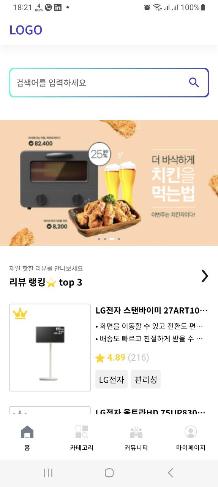
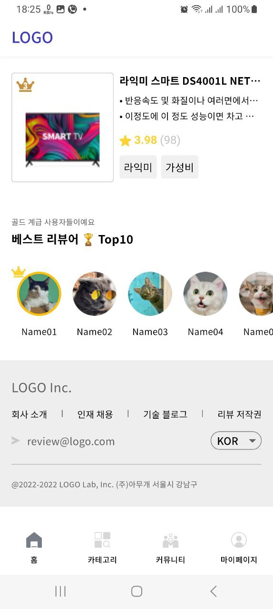

# Flutter Shopping UI

A Flutter application showcasing a shopping UI with various features and components.

## Features

- **Homepage:** Displays animated banners, top products, and user lists.
- **Product Cards:** Detailed view of top products with ratings and reviews.
- **User Lists:** Lists top users with avatars and ranking icons.
- **Footer:** Includes company information and navigation links.

## Screenshots




## Getting Started

Follow these instructions to get a copy of the project up and running on your local machine for development and testing purposes.

### Prerequisites

- Flutter SDK
- Android/iOS emulator or device

### Installing

Clone the repository:

```bash
git clone https://github.com/ETdvlpr/shopping_ui.git
cd shopping_ui/
```

Install dependencies:

```bash
flutter pub get
```

### Running

Run the app on an emulator or device:

```bash
flutter run
```

## Built With

- Flutter - UI toolkit for building natively compiled applications for mobile, web, and desktop from a single codebase.

## Authors

- [David Samuel](https://github.com/ETdvlpr) - Developer

## License

This project is licensed under the MIT License - see the [LICENSE](LICENSE) file for details.